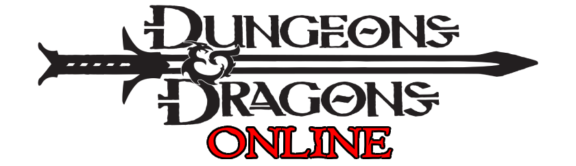
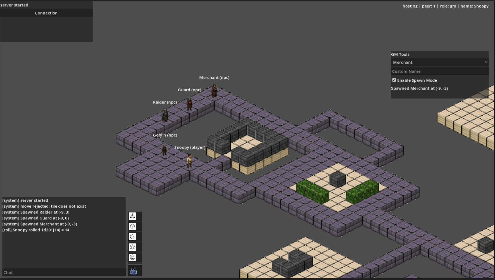

<p align="center">
  
</p>

<p align="center">
  
  
  
  
</p>

# DnD-Online

DnD-Online is a small virtual tabletop prototype built in Godot. The current goal is a playable multiplayer board for D&D-style sessions: one shared isometric map, authoritative server state, player tokens, NPC tools for the GM, chat, dice rolls, and a growing persistent character model.

This is not trying to be a finished rules engine yet. The project is currently focused on making the core table feel solid before adding encounter/combat depth.



## Current MVP Status

Implemented:

- Godot 4 multiplayer bootstrap with `ENetMultiplayerPeer`.
- Host/Join flow with GM/player roles.
- Server-authoritative state snapshots for players and actors.
- Shared ProtoCRPG-style isometric map in `ProtoBoard`.
- Server-authoritative click movement with path validation.
- Movement lifecycle hardening: movement locks, reject reason codes, no client-authoritative token edits.
- Multiplayer chat broadcast.
- Dice buttons and `/roll` / `/r` command with server-side rolls.
- Dice roll sound broadcast on roll result.
- GM Spawn Tool for NPC placement by clicking map tiles.
- GM actor selection, multi-selection for delete, selected marker, and GM-controlled movement for one actor at a time.
- Persistent `CharacterState` skeleton with `client_id -> owner_key`.
- `RaceRegistry` with human, elf, orc, and dwarf.
- Read-only `CharacterSheetPanel v0`.
- JSON persistence skeleton under `user://server_data/`.

In progress / next:

- Character creation and character select UI.
- Better persistence for character runtime fields such as last tile, HP, AP.
- Encounter Mode v0: initiative, active actor, AP budget, next turn.
- Combat actions and damage.
- Path preview and clearer movement feedback.
- Fog of war and visibility rules.
- Cleaner public UI pass once the gameplay loop stabilizes.

## How To Run

Open the project in Godot 4.6.x and run:

```text
res://scenes/main/MvpRoot.tscn
```

For a local two-window network test:

1. Run two instances from Godot's multiple instance runner.
2. In the first window, enter a GM name and press `Host`.
3. In the second window, enter a player name and press `Join`.
4. Use `127.0.0.1` and port `7000`.

Expected result:

- Host status shows `hosting | role: gm`.
- Client status shows `connected | role: player`.
- Both windows see the same actors.
- Player movement, chat, dice, and GM NPC tools sync through the server.

## Controls

- Left click map: request movement for your selected actor.
- GM Select Actor mode: click actor tile to select.
- Hold `Shift` in GM Select Actor mode: toggle multi-selection.
- GM Move Selected mode: move exactly one selected actor.
- GM Delete Selected: delete selected NPC actors only.
- `C`: toggle local character sheet.
- Chat input supports normal messages, `/roll`, and `/r`.

## Architecture Notes

The server is authoritative. Clients send intents; the server validates and broadcasts accepted state changes.

Important split:

- `CharacterState`: persistent player character data.
- `ActorState`: temporary map/token representation.
- `PlayerState`: network session record that links peer, owner, character, and actor.

No physics-driven movement is used for MVP board rules. Tile checks come from `TileMapLayer`, `TileRules`, and server-side state.

## Project Layout

```text
scenes/main/          runtime root scene
scenes/world/         ProtoBoard map scene
scenes/entities/      token scenes
scenes/ui/            connection, chat, dice, GM tools, character sheet
scripts/autoload/     network/session/rules registries
scripts/server/       server-side services
scripts/client/       render and UI coordination
scripts/shared/       shared payload keys and constants
tileset/              project visual assets
docs/assets/          README images
docs_work/            ignored development notes
TEMPLATES/            ignored reference projects
```

## Tech Stack

- Godot 4.6.x
- GDScript
- Godot `ENetMultiplayerPeer`
- Server-authoritative multiplayer flow
- JSON MVP persistence via `user://`

## Assets And References

- ProtoCRPG visual base is used as the core map/style reference.
- Infernus Tileset: https://pvgames.itch.io/infernus-tileset
- Donor/reference projects live under ignored `TEMPLATES/` and are not copied wholesale.

Ar-r dwarfs keep going straight!
